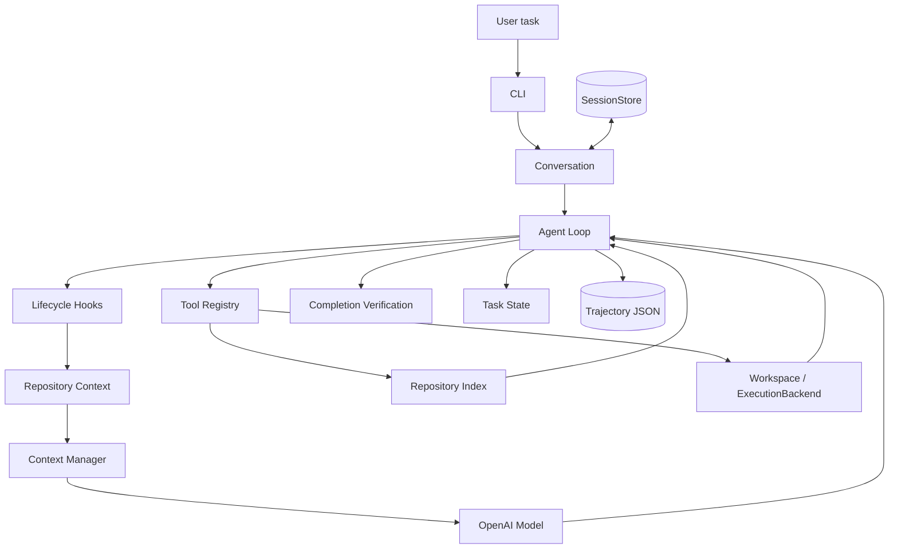

<p align="center">
  
</p>

<p align="center">
  一个核心流程透明、可以持续扩展的本地 CLI Coding Agent。
</p>

<p align="center">
  
  
  
  
</p>

---

Trouvaille 接收自然语言任务，自主查看和修改代码、运行命令、验证结果，并在终端中清晰展示每一步。项目显式实现了 Agent Loop、消息流、工具调度和停止条件，OpenAI SDK 仅用于模型请求，没有依赖 LangGraph 或 LangChain Agent runtime。

> 当前处于 MVP 阶段，适合学习 Coding Agent 的组成方式、研究 Agent Loop，或在受信任的本地代码仓库中进行实验。

## 功能亮点

- **自主编码循环**：模型调用、工具执行、结果回填和停止条件都由项目自己的 Agent Loop 控制。
- **连续对话与 Session**：同一次启动内共享完整消息历史，也可以跨进程恢复 workspace 中保存的会话。
- **Repository Intelligence**：安全发现仓库文件，使用 Python AST 建立索引，并按当前任务生成有界的 repo map。
- **上下文管理**：针对每次模型调用生成临时上下文，压缩大型工具结果并摘要较旧的完整 Run。
- **完成前验证**：修改文件后，Agent 必须提供最新的成功 `verify` 证据，才能接受最终回答。
- **Workspace 边界**：原生文件工具只能访问项目资源，不会直接暴露 `.agentcore/` 或 workspace 外部文件。
- **可追踪执行**：每次用户请求生成一份独立的 trajectory JSON，记录模型步骤、工具结果和验证状态。
- **轻量实现**：运行时依赖只有 OpenAI SDK 和 python-dotenv，核心结构保持直接、可读。

## 快速开始

### 1. 准备环境

需要安装 [Python 3.12+](https://www.python.org/) 和 [uv](https://docs.astral.sh/uv/)。在项目根目录执行：

```bash
uv sync
```

### 2. 配置模型

在项目根目录创建 `.env`：

```dotenv
OPENAI_API_KEY=your-api-key
OPENAI_MODEL=your-model-id
```

`.env` 已被 Git 忽略。请勿将真实 API key 提交到仓库。

### 3. 启动 Trouvaille

让 Agent 操作当前目录：

```bash
uv run trouvaille
```

更常见的方式是显式指定需要操作的项目：

```bash
uv run trouvaille --workspace /path/to/your/project
```

启动后直接输入任务：

```text
User > 找到计算总价的逻辑，修复折扣计算错误并运行测试
```

输入 `exit` 或 `quit` 退出。

## 使用方式

### 交互模式

```bash
# 新建会话
uv run trouvaille --workspace /path/to/project

# 从列表中选择历史 Session
uv run trouvaille --workspace /path/to/project --resume

# 恢复指定 Session
uv run trouvaille --workspace /path/to/project --resume <session-id>

# 恢复最近更新的 Session
uv run trouvaille --workspace /path/to/project --continue

# 调整每个 Run 的最大模型调用次数，CLI 默认值为 30
uv run trouvaille --workspace /path/to/project --max-steps 50
```

同一次 CLI 启动中的多次输入共享 conversation history。Session 保存到目标 workspace 的 `.agentcore/sessions/`，使用 `--resume` 或 `--continue` 可以在下次启动时继续。

### 单次任务

```bash
uv run trouvaille \
  --workspace /path/to/project \
  --task "分析这个项目的入口和主要模块"
```

`--task` 执行一个 Run 后退出，并生成 trajectory；它不会创建或更新 Session，也不能与 `--resume`、`--continue` 一起使用。

查看全部参数：

```bash
uv run trouvaille --help
```

## 工作原理



一次用户请求称为一个 **Run**。一个 Run 可以包含多次模型调用和工具调用，并受 `max_steps` 限制。Agent 得到候选最终回答后，会先经过 completion verification；满足完成条件后才结束本次 Run。

### 三种记录各自负责什么

| 部件 | 保存范围 | 用途 |
| --- | --- | --- |
| Conversation / Session | 多个 Run 的完整 raw message history | 让后续请求理解此前对话；Session 支持跨进程恢复 |
| Model-facing context | 当前一次 model call 的临时消息视图 | 注入 repo map、控制上下文预算，不改写原始历史 |
| Trajectory | 单个 Run 的执行记录 | 审计本次模型步骤、工具调用、验证结果和最终状态 |

Repository Context 先注入一份与当前任务相关、具有严格字符预算的 repo map，Context Manager 再根据真实上下文开销进行压缩。临时 repo map、压缩内容和被 verification 拒绝的候选回答不会写入持久 Session。

## 内置工具

| 类别 | 工具 | 作用 |
| --- | --- | --- |
| 文件 | `list_files` | 列出 workspace 内的目录内容 |
| 文件 | `read_file` | 读取 UTF-8 文件 |
| 文件 | `write_file` | 写入 UTF-8 文件 |
| 文件 | `edit_file` | 替换恰好出现一次的文本 |
| 搜索 | `search` | 在文件中搜索字面字符串 |
| 仓库 | `repo_map` | 查看有界的结构化 repository map |
| 仓库 | `find_symbol` | 按 qualified name 或短名称查找 Python symbol |
| 仓库 | `find_references` | 查找有界的 syntactic identifier references |
| 执行 | `shell` | 在 workspace 根目录执行命令 |
| 执行 | `verify` | 运行显式验证命令并记录完成证据 |
| Git | `git_diff` | 查看已跟踪文件的未暂存改动 |

Repository Index 在 Git 仓库中优先通过 `git ls-files` 发现 tracked 和 untracked 文件，并遵守 `.gitignore`；非 Git 目录使用带常见 generated/vendor 排除项的安全遍历。所有候选路径最终仍需通过 `AgentWorkspaceView` 的资源边界检查。

Python 文件通过标准库 `ast` 提取 class、function、method、async symbol、signature、imports 和 syntactic references。repo map 用于定位代码，Agent 在修改前仍应通过 `read_file` 查看精确源码。

## 运行数据

Trouvaille 在目标 workspace 中维护以下内部数据：

```text
<workspace>/.agentcore/
├── sessions/       # 可恢复的完整对话历史
└── trajectories/   # one Run → one JSON 执行记录
```

`.agentcore/` 是运行时内部目录。原生文件工具无法直接访问它，但 SessionStore 和 trajectory writer 可以通过专用内部接口写入。trajectory 可能包含用户任务、模型回答和工具返回的源码内容，请按本地敏感数据处理。

## 项目结构

```text
.
├── src/trouvaille/
│   ├── agent.py          # Agent Loop 与 Run 生命周期
│   ├── cli.py            # 命令行入口与终端展示
│   ├── conversation.py   # 当前进程中的连续对话
│   ├── session.py        # workspace 级持久 Session
│   ├── context.py        # model-facing context 管理
│   ├── repository.py     # AST index、ranking 与 repo map
│   ├── lifecycle.py      # 同步生命周期扩展点
│   ├── tools.py          # 工具定义与分发
│   ├── workspace.py      # 资源边界
│   ├── execution.py      # 命令执行后端
│   ├── verification.py   # completion verification gate
│   ├── task_state.py     # 当前 Run 的操作事实
│   ├── trajectory.py     # 单 Run 执行记录
│   ├── messages.py       # 内部 Message / ToolCall 结构
│   └── model.py          # OpenAI Responses API 适配
├── docs/assets/            # README 品牌资源
├── pyproject.toml          # 包配置与 CLI entry point
└── uv.lock                 # 可复现的依赖锁文件
```

## 开发检查

以下检查不需要调用真实 API：

```bash
uv run trouvaille --help
uv run python -m compileall -q src
```

## 安全边界

- `list_files`、`read_file`、`write_file`、`edit_file` 和 `search` 只能访问 workspace 内的 PROJECT 资源。
- `.agentcore/`、workspace 外部路径以及指向这些位置的符号链接不会暴露给原生文件工具。
- `shell` 与 `verify` 复用同一个 `LocalExecutionBackend`，当前没有操作系统级 sandbox 或命令审批。
- 因此请只在受信任的 workspace 中运行，并在提交前检查 Agent 产生的修改。

## 当前限制

- 当前仅支持 OpenAI provider。
- Verification v1 检查的是显式执行证据，不会独立判断业务语义是否正确；验证命令由模型选择。
- Verification v1 只跟踪原生 `write_file` / `edit_file` 修改，通过 `shell` 改动文件可能不会让旧证据失效。
- Repository Intelligence v1 只解析 Python AST；references 是 syntactic best effort，不具备 LSP、类型推断或动态调用解析能力。
- Repository Index 只做进程内增量缓存，不会持久化。
- 当前没有长期记忆、planner、subagent、Web UI、IDE 扩展或进程 sandbox。

## 项目状态

Trouvaille 已具备一个基础 Coding Agent 的完整主链路，当前重点是保持核心简单、明确、可测试，再逐步扩展更强的安全控制、模型支持和工程能力。
